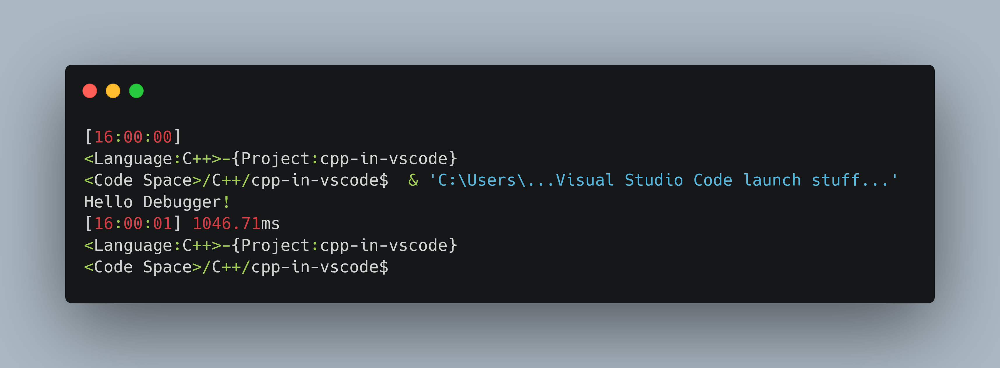
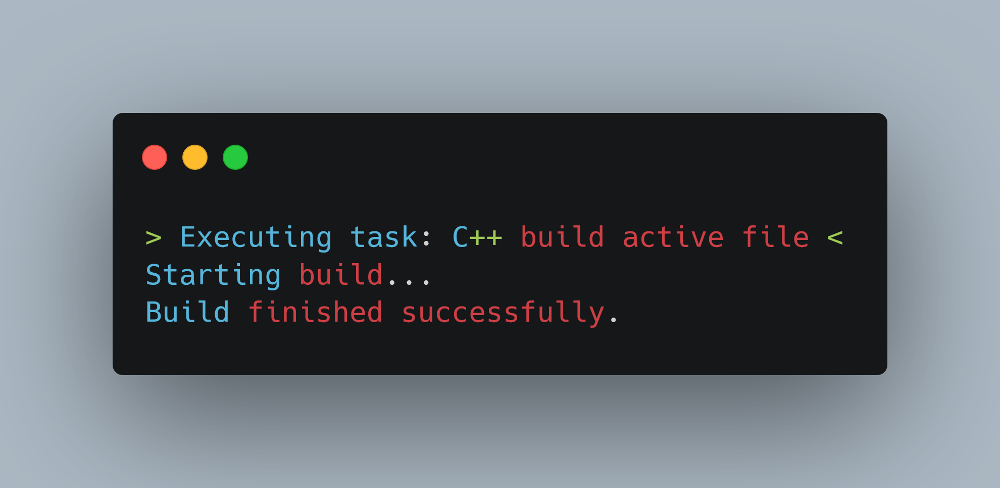
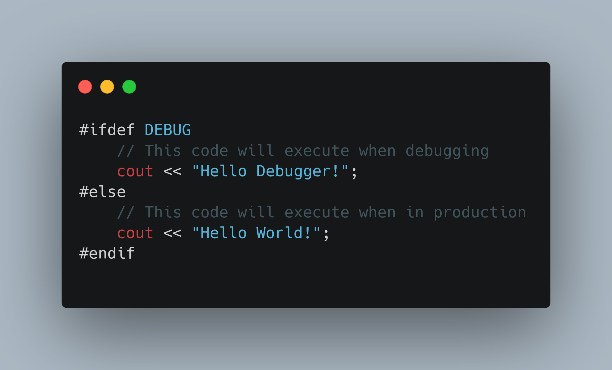

# C++ in VSCode

This is a simple "Hello World!" program showing simple and Yet very powerfull options which can be enabled in Visual Studio Code

- [C++ in VSCode](#c-in-vscode)
- [Tasks](#tasks)
  - [Build tasks](#build-tasks)
  - [Miscellaneous tasks](#miscellaneous-tasks)
- [Launch](#launch)
  - [Build, run and Debug](#build-run-and-debug)
  - [Passing preprocessor tokens](#passing-preprocessor-tokens)
- [Snippets](#snippets)
- [Documentation](#documentation)
- [Shortcuts](#shortcuts)
  - [Project Keyboard shortcuts](#project-keyboard-shortcuts)
  - [Other Keyboard shortcuts](#other-keyboard-shortcuts)
  - [Build shortcuts](#build-shortcuts)
- [Customize](#customize)

# Tasks

## Build tasks
the tasks used in this example are mainly build tasks. these will compile and move the binaries to the right directory.  
this way a debug exe is never placed in the bin folder. if everything goes well it shouldn't even be there after debugging.  
It's like creating a little CMake out of vscode tasks
## Miscellaneous tasks
I've added a few extra tasks, these aren't done, but they show how shell commands also can be used as task. for example to clean a binary after the debug session. 

# Launch

## Build, run and Debug
if you configure everything right, a single hit on `F5` should build you code, run it, debug it and clean it up afterwards.  
The combination of launch tasks and build tasks is very simple, yet super effective.
## Passing preprocessor tokens
by using the `-D` flag with g++ you can pass tokens read by the preprocessor, like the one I use: `DEBUG`
# Snippets
the cpp.code-snippets are a great way of inserting often used pieces of code.
my own preferences is creating own snippets, this way I know what the code this, and gain a speed boost in development
# Documentation
in the "Hello World!" is a little bit of documentation, if you search for c++ documenting, you'll find some good guides.
VSCode can (and will) read the documentation, and will show it to you in a floating textbox.
# Shortcuts
## Project Keyboard shortcuts
These two shortcuts will increase your productivity 10x times  
- Building code: `Ctrl` + `Shift` + `B`  
- Start debug session: `F5`
## Other Keyboard shortcuts
There are a lot of other keyboard shortcuts
a few of my favorites are:
- `Ctrl` + `Shift` + `P` -> open the command palette  
- `Ctrl` + `B` -> open and close the side panel  
- `Ctrl` + `J` -> open and close the terminal window  
- `Ctrl` + `\`` -> open the terminal window  
- `Ctrl` + `Shift` + `\`` -> open a new window  

There are more like `Alt` + `R` in combination with `Ctrl` + `Shift` + `H` is very powerfull, but that's for you to find out!
or some others, 
- `Alt` + `Shift` + `{arrow key}`
- `Ctrl` + `D`
- `Ctrl` + `Alt` + `{arrow key}`

## Build shortcuts
There aren't any shortcuts for building great code, so you'll have to do it the (Sm)hard way.
You can't code faster, but you can: build -> run -> debug -> revert faster!
# Customize
it seems only time consuming, but it's actually a great way of learning you IDE better!.
I'm using VSCode for Java, Web, Python & C++ development and also for general text editing  the options like "regex find and replace in multiple files is AWESOME!!" 
on top of VSCode, i've also constumized my terminal(Powershell 7), some shortcuts, extra info for coding projects like the language and project name(very helpful when working with multiple editors open)